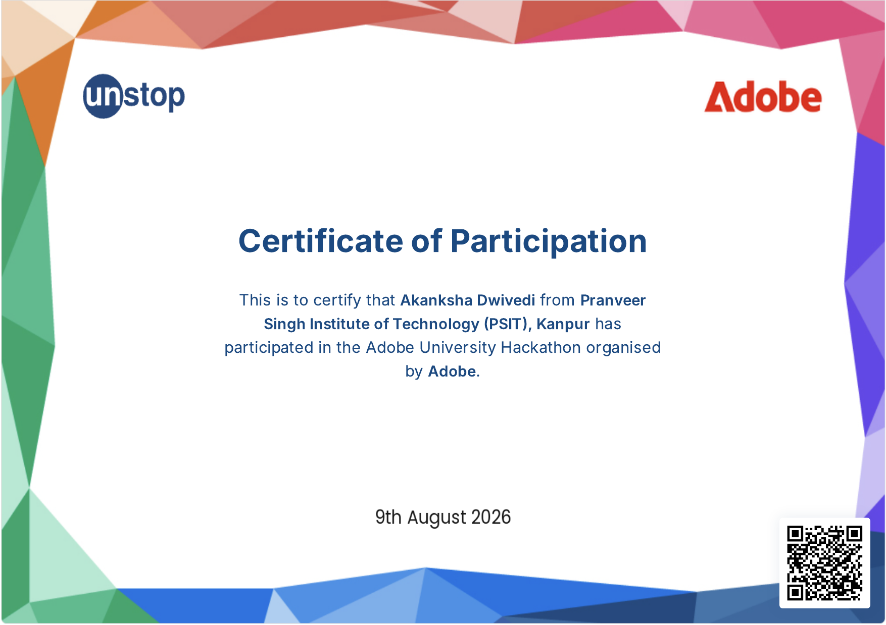

 

---

# 👋 About Me

I'm a 3rd-year Computer Science Engineering (Artificial Intelligence and Machine Learning) student at PSIT Kanpur.
I enjoy building practical systems at the intersection of:

- 🤖 Machine Learning
- 📊 Data Science & Analytics
- 🧠 Generative AI
- 🔎 RAG & Semantic Search
- ⚙️ Python & Backend Engineering

My goal is to build strong, production-oriented projects and become internship-ready for AI/ML Engineering, Data Science, Python Backend, and Generative AI roles.

| Focus | Current Direction |
|---|---|
| 🎓 Education | B.Tech CSE — Data Science |
| 🧰 Core Stack | C++, Python, JavaScript, React, LangChain, LangGraph |
| 📊 Data | Pandas, NumPy, Scikit-learn, visualization |
| 🤖 AI | Machine Learning, NLP, RAG, Local LLM systems |
| 🔎 Interests | AI systems, semantic search, analytics products |
| 🚀 Goal | AI/ML, Data Science, GenAI & Agentic-AI internships |

---

# 🧠 Project Terminal

  
    <code>PROJECTS.SYS</code> — Systems, AI architectures, data products & experiments
  

<b>▶ OPEN PROJECT TABLE</b> <i>(Click to expand)</i>

 

| Project | What It Solves | Tech / Concepts | Why It Matters |
|---|---|---|---|
| **[GenAI Mini Projects](https://github.com/Akanksha-1708/Genai-mini-projects)** | A structured collection of Generative AI applications covering AI profile generation, PDF summarization, semantic search, personal knowledge RAG, tool calling, multi-tool agents, and an AI knowledge & research assistant. | Python, LangChain, Hugging Face, Chroma, Embeddings, RAG, Tool Calling, Agents, Tavily, Pydantic | Demonstrates hands-on understanding of core GenAI application patterns — from document processing and semantic search to RAG, tool use, and multi-step AI agents. |
| **[Agentic AI Mini Projects](https://github.com/Akanksha-1708/Agentic-AI-mini-projects)** | A structured collection of Agentic AI workflows covering sequential, parallel, conditional, iterative, and state-based workflows, along with a persistent chatbot. | Python, LangGraph, LangChain, LLMs, State, Nodes, Edges, Conditional Routing, Memory, Streamlit | Shows practical understanding of agent orchestration and workflow design, including state management, routing, iterative execution, and persistent conversational AI. |
| **[Machine Learning Projects](https://github.com/Akanksha-1708/Machine-learning-mini-projects)** | A collection of ML learning projects focused on applying machine learning concepts to practical prediction and analysis problems. | Python, NumPy, Pandas, Scikit-learn, Matplotlib, Statsmodels, Regression, Feature Engineering, ML Pipelines | Demonstrates the progression from ML fundamentals to implementing, evaluating, and organizing practical machine learning projects. |
| **[GitVerse](https://github.com/Akanksha-1708/GitVerse)** | A web application for exploring and comparing GitHub profiles, viewing repository statistics, and visualizing GitHub analytics. | HTML, CSS, JavaScript, GitHub API, Chart.js, GSAP | Shows frontend development skills and practical API integration while turning GitHub data into an interactive analytics experience. |
| **[SkillSwap](https://github.com/Akanksha-1708/Skillswap-react)** | A skill-exchange platform where users can trade skills instead of money, with AI-powered match recommendations and real-time collaboration features. | React, Vite, Firebase, Tailwind CSS, AI-powered matching, Web App Development | Demonstrates building a complete user-facing application while combining modern frontend development, backend services, and AI-powered product features. |

 

  

# 🛠️ What I Build

<table> <tr> <td width="33%" align="center">
🧠 Generative AI

RAG applications, embeddings, semantic search, tool calling, and LLM-powered applications using LangChain and Hugging Face.

</td> <td width="33%" align="center">
🤖 Agentic AI

LangGraph workflows, stateful agents, routing, sequential and parallel workflows, iterative agents, and multi-step AI systems.

</td> <td width="33%" align="center">
🌐 AI-Powered Web Apps

React-based applications, AI-powered features, GitHub analytics, API integrations, and collaborative platforms like SkillSwap.

</td> </tr> </table>

---

# 💻 Tech Stack

---

# 🧩 Problem Solving

---

# 📊 GitHub Activity

---

# 🏆 Hackathons & Certifications

## 🚀 Hackathons

<b>▶ HACKATHONS</b> <i>(Click to expand)</i>

 

<table>

<tr>

<table>

<tr>

<td width="25%" align="center">

 

<b>Adobe University Hackathon</b>

</td>

</tr>

</table>

Participant in the <b>Adobe University Hackathon</b>, organized by Adobe.

---
# 🎯 Current Mission

```mermaid
flowchart LR
    A[Master DSA & Problem Solving] --> B[Strengthen ML Foundations]
    B --> C[Build Practical ML Projects]
    C --> D[Build GenAI & RAG Applications]
    D --> E[Master Agentic AI & LangGraph]
    E --> F[Build Production-Oriented AI Projects]
    F --> G[Strengthen GitHub & Open Source]
    G --> H[Become Internship-Ready AI/ML Engineer]

    style H fill:#0D1117,stroke:#00D9FF,color:#00D9FF
```

# 📬 Let's Connect

<b>Open to AI/ML, Generative AI, and Software Engineering internship opportunities.</b>

  

<a href="mailto:akadwi96@gmail.com">Email</a>
&nbsp; • &nbsp;
<a href="https://www.linkedin.com/in/akanksha-dwivedi-741623317">LinkedIn</a>
&nbsp; • &nbsp;
<a href="https://github.com/Akanksha-1708">GitHub</a>
&nbsp; • &nbsp;
<a href="https://leetcode.com/u/4L4ZPTMTQF/">LeetCode</a>

  

  

